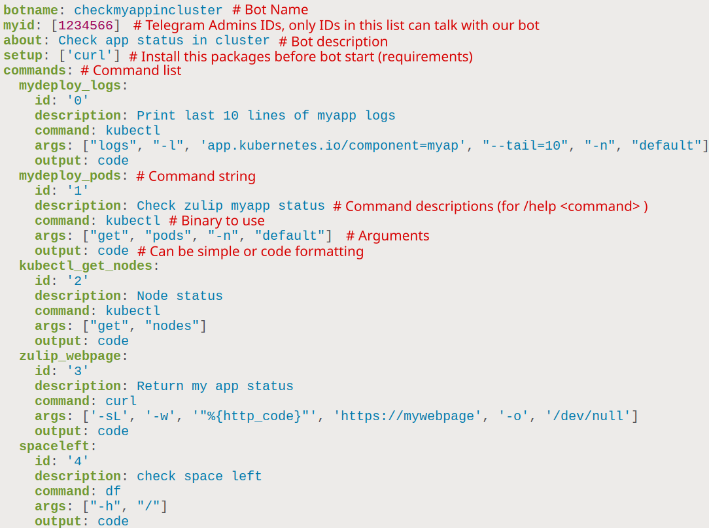

# TG2 - Telegram bash bot made easy

Create your bot with a simple config file and you are ready to go!



## Usage

Create your config file, see [examples](./examples)

### Docker

```shell
export TG_TOKEN="123455:32233"
docker run -i -t --rm -e TGTOKEN=${TG_TOKEN} -v myconfigfile.yaml:/usr/src/bot/config.yaml brokenpip3/tg2:0.0.1
```

### Kubernetes

```shell
kubectl create secret generic tg2-token --from-literal=TGTOKEN=2121211212
kubectl create configmap tg2-setting --from-file=config.yaml=myconfig.yaml
kubectl apply -f kubernetes/deployment.yaml
```

## Todo

- [X] install prerequisites before bot start
- [ ] better docs
- [ ] hot reload config file
- [ ] pip package
- [ ] handle more the one argument in chat commands
